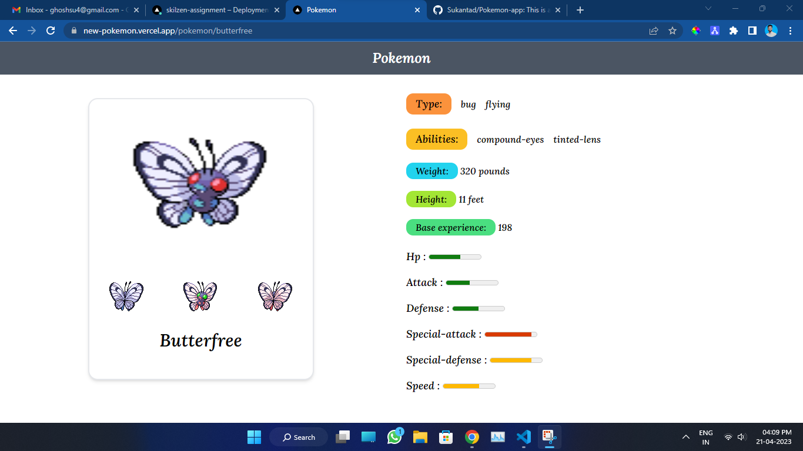

## Home Assignment for NextJs Dev

### Tech Stack

- Next.js
- TailWindCss

### How to run in local

- First Clone this git repo
- npm i (install all dependencies package)
- npm run dev

### How to deploy on vercel

- First npm i -g vercel
- vercel and put your email id
- Deployed link- https://skilzen-assignment.vercel.app/

### Home page how look like

   

### Every individual pokemon page

 
